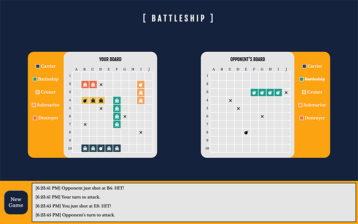

# Battleship

A [battleship game](https://en.wikipedia.org/wiki/Battleship_(game)) (also known as Battleships or Sea Battle) built with [react](https://reactjs.org/) and [socket.io](https://socket.io/).  
The project is built on [create-react-app-example](https://github.com/socketio/socket.io/tree/master/examples/create-react-app-example) of [Socket.io](https://socket.io/). 
The example is bootstrapped with [Create React App](https://github.com/facebook/create-react-app).

## Table of Content

- [Live Demo](#live-demo)
- [Final Product](#final-product)
- [Custom hook: useGame](#custom-hook-usegame)
- [Dependencies](#dependencies)
- [Getting Started](#getting-started)
- [File Structure](#file-structure)
- [Credits](#credits)

## Live Demo

The server is deployed to Heroku. Netlify serves the static client assets:  
https://the-battleship.netlify.app/  
It might take the server some time to start up when you enter the page.

## Final Product

## Custom hook: useGame

useGame is a custom hook that control the flow of the game.
- A state contains all the details of the player.
- A reducer handle actions

### state

#### gameState

- 0: Waiting for another player to join

- 1: Players are ready, picking tiles for battleship

- 2: Done with picking tiles, waiting for the opponent to be done

- 3: Player's turn to shoot

- 4: Opponent's turn to shoot

- 5: Player won

- 6: Player lost

#### messages: Array of object

Array of messages

#### myShips: array of Object

#### opponentShips: Array of Object

#### opponent: null / string

#### gotInitialOpponent: boolean

#### haveSendInitialMsg: boolean

## Dependencies

## Getting Started

In the project directory, you can run:

### `npm start`

Runs the app in the development mode. 
Open [http://localhost:3000](http://localhost:3000) to view it in the browser.

The page will reload if you make edits. 
You will also see any lint errors in the console.

### `npm run start-server`

Starts the Socket.IO server.

### `yarn test`

Launches the test runner in the interactive watch mode. 
See the section about [running tests](https://facebook.github.io/create-react-app/docs/running-tests) for more information.

### `npm build`

Builds the app for production to the `build` folder. 
It correctly bundles React in production mode and optimizes the build for the best performance.

The build is minified and the filenames include the hashes. 
Your app is ready to be deployed!

## File Structure

## Credits
- [Icon](https://www.flaticon.com/premium-icon/ship_870170) created by [Freepik](https://www.flaticon.com/authors/freepik) - [Flaticon](https://www.flaticon.com/)