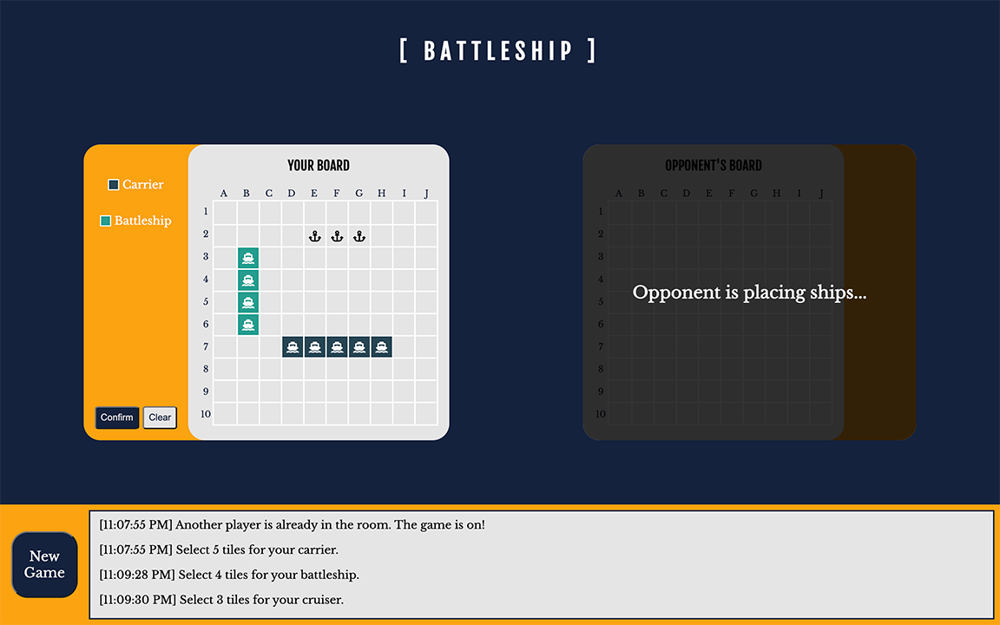
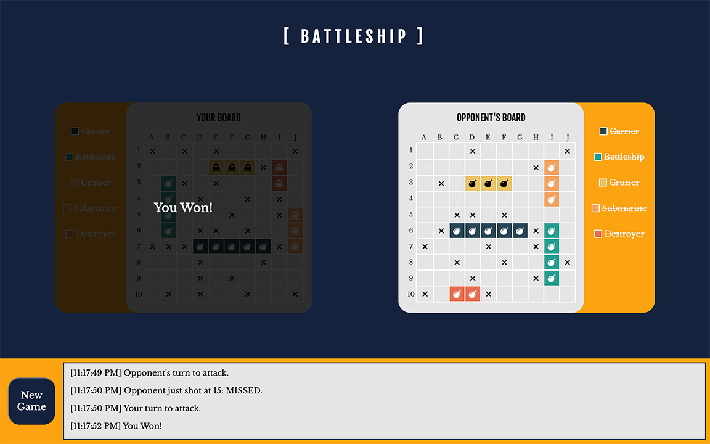

# Battleship

A [battleship game](https://en.wikipedia.org/wiki/Battleship_(game)) (also known as Battleships or Sea Battle) built with [React](https://reactjs.org/) and [Socket.io](https://socket.io/).  
The project is built on [create-react-app-example](https://github.com/socketio/socket.io/tree/master/examples/create-react-app-example) of [Socket.io](https://socket.io/). 
The example is bootstrapped with [Create React App](https://github.com/facebook/create-react-app).

## Table of Content

- [Live Demo](#live-demo)
- [Final Product](#final-product)
- [About the Game](#about-the-game)
- [Custom hook: useGame](#custom-hook-usegame)
- [Dependencies](#dependencies)
- [Getting Started](#getting-started)
- [File Structure](#file-structure)
- [Credits](#credits)

## Live Demo

The server is deployed to Heroku. Netlify serves the static client assets:  
https://the-battleship.netlify.app/  
It might take the server some time to start up when you enter the page.

## Final Product

1. When a player first enter the game, the player need to wait for another player if there is no available player (For testing purpose, they can also open a new tab to create another player)


2. When the player get an opponent, the players can pick the tiles for their ships. They can clear/confirm tiles. Errors are shown in log (at the bottom of the page).




3. After both players have done picking the tiles for their ships. Players start taking turn to shoot at opponent's board. All the shooting is displayed on the boards. They are also shown on the log with coordinate and either MISSED or HIT. When a ship is destroyed, it is shown on the ship list (next to each game board) with a strike-through  and the log.


4. When there is a winner, it is shown on the board and the log. The player can click the "New Game" button to start a new game. Players can click the button anytime to start a new game.



## About the Game

Each player has a 10x10 board on which the player is able to place 5 ships:
- A Carrier, which is 5 tiles long
- A Battleship, which is 4 tiles long
- A Cruiser, which is 3 tiles long
- A Submarine, which is 3 tiles long
- A Destroyer, which is 2 tiles long

Each ship can be placed either horizontally or vertically on the board, and cannot be placed partially off the board.  

Each tile is denoted by a coordinate, A-J for columns and 1-10 for rows.  

Each player then takes turns picking a tile on the opposing player’s grid, taking a shot at that tile.  
- If the tile contains a ship, the shot is a HIT
- If the tile does not contain a ship, the shot is a MISS.

A ship is sunk if all the tiles for that ship have been marked as a HIT.

The game ends when one player has sunk all of the opposing players ships.

## Custom hook: `useGame`

useGame is a custom hook that control the flow of the game.
- A state contains all details of the player.
- A reducer handle actions

### `state`

#### `gameState`

- 0: Waiting for another player to join
- 1: Players are ready, picking tiles for battleship
- 2: Done with picking tiles, waiting for the opponent to be done
- 3: Player's turn to shoot
- 4: Opponent's turn to shoot
- 5: Player won
- 6: Player lost

#### `shipTilesState`

- 0: Selecting tiles for the carrier, which is 5 tiles long
- 1: Selecting tiles for the battleship, which is 4 tiles long
- 2: Selecting tiles for the cruiser, which is 3 tiles long
- 3: Selecting tiles for the submarine, which is 3 tiles long
- 4: Selecting tiles for the destroyer, which is 2 tiles long

## Dependencies

- [node](https://nodejs.org/)
- [React](https://reactjs.org/)
- [Socket.io](https://socket.io/)

## Getting Started

1. Clone this project to your computer
2. `cd` to the folder where this project is cloned
3. Install all dependencies with `npm install` command
4. Run the Socket.IO server with `npm run start-server` command
5. Run the app in the development mode with `npm start` command
6. Open the broswer and visit: http://localhost:3000

The page will reload if you make edits. You will also see any lint errors in the console.

## File Structure
```
📦battleship
 ┣ 📂docs
 ┣ 📂public
 ┃ ┣ 📜background.jpg
 ┃ ┣ 📜favicon.png
 ┃ ┗ 📜index.html
 ┣ 📂src
 ┃ ┣ 📂Components
 ┃ ┃ ┣ 📂Display
 ┃ ┃ ┃ ┣ 📂Board
 ┃ ┃ ┃ ┃ ┣ 📂Coordinate
 ┃ ┃ ┃ ┃ ┃ ┣ 📜Coordinate.css
 ┃ ┃ ┃ ┃ ┃ ┣ 📜CoordinateLabelList.jsx
 ┃ ┃ ┃ ┃ ┃ ┣ 📜CoordinateLabelListItem.jsx
 ┃ ┃ ┃ ┃ ┃ ┣ 📜CoordinateList.jsx
 ┃ ┃ ┃ ┃ ┃ ┣ 📜CoordinateListItem.jsx
 ┃ ┃ ┃ ┃ ┃ ┗ 📜index.jsx
 ┃ ┃ ┃ ┃ ┣ 📂ShipList
 ┃ ┃ ┃ ┃ ┃ ┣ 📜ShipList.css
 ┃ ┃ ┃ ┃ ┃ ┣ 📜ShipListItem.jsx
 ┃ ┃ ┃ ┃ ┃ ┣ 📜TileButtons.jsx
 ┃ ┃ ┃ ┃ ┃ ┗ 📜index.jsx
 ┃ ┃ ┃ ┃ ┣ 📜Board.css
 ┃ ┃ ┃ ┃ ┣ 📜Overlay.jsx
 ┃ ┃ ┃ ┃ ┗ 📜index.jsx
 ┃ ┃ ┃ ┣ 📜Display.css
 ┃ ┃ ┃ ┗ 📜index.jsx
 ┃ ┃ ┣ 📂Log
 ┃ ┃ ┃ ┣ 📜Log.css
 ┃ ┃ ┃ ┣ 📜LogListItem.jsx
 ┃ ┃ ┃ ┣ 📜NewGameButton.jsx
 ┃ ┃ ┃ ┗ 📜index.jsx
 ┃ ┃ ┗ 📜Heading.jsx
 ┃ ┣ 📂hooks
 ┃ ┃ ┣ 📜useGame.js
 ┃ ┃ ┗ 📜useScrollToBottom.js
 ┃ ┣ 📜App.css
 ┃ ┣ 📜App.jsx
 ┃ ┣ 📜App.test.js
 ┃ ┣ 📜constants.js
 ┃ ┣ 📜helpers.js
 ┃ ┗ 📜index.js
 ┣ 📜.gitignore
 ┣ 📜README.md
 ┣ 📜helpers.js
 ┣ 📜package-lock.json
 ┣ 📜package.json
 ┗ 📜server.js
```
## Credits
- [Icon](https://www.flaticon.com/premium-icon/ship_870170) created by [Freepik](https://www.flaticon.com/authors/freepik) - [Flaticon](https://www.flaticon.com/)